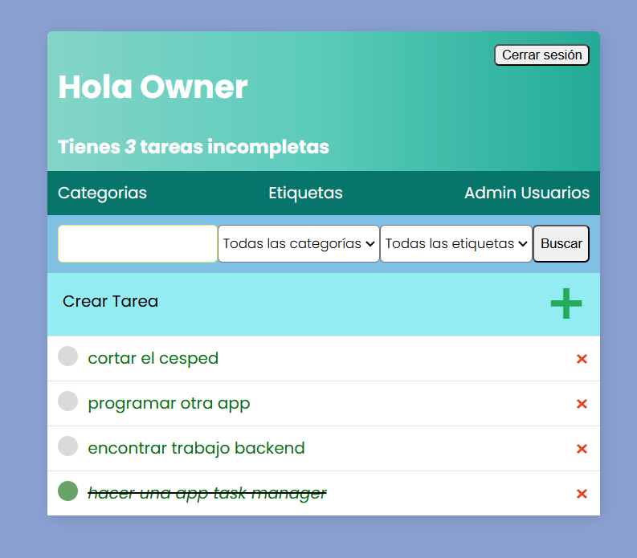
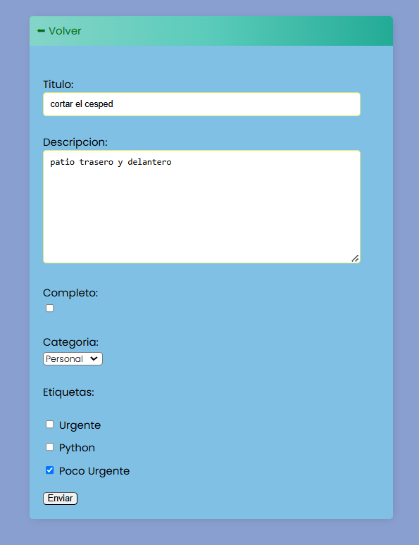
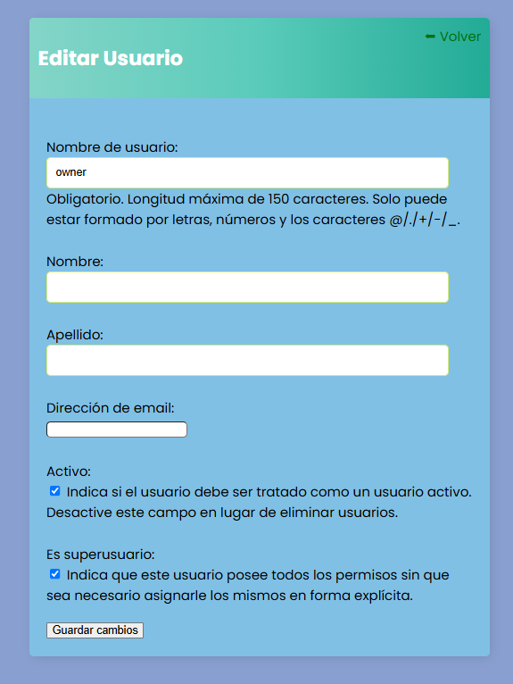
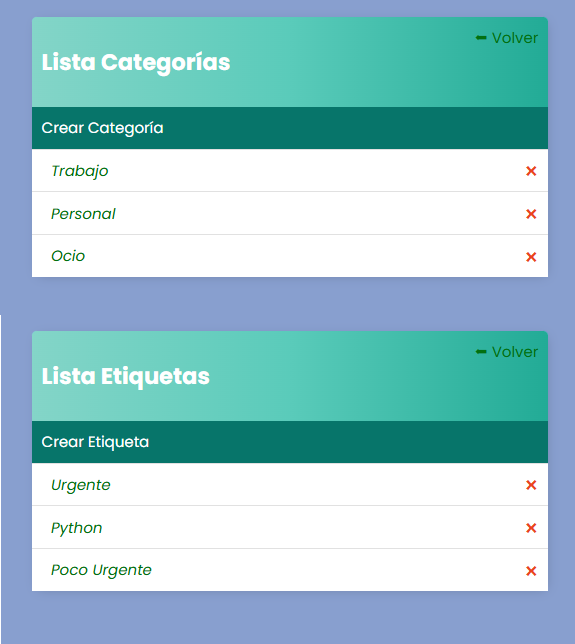
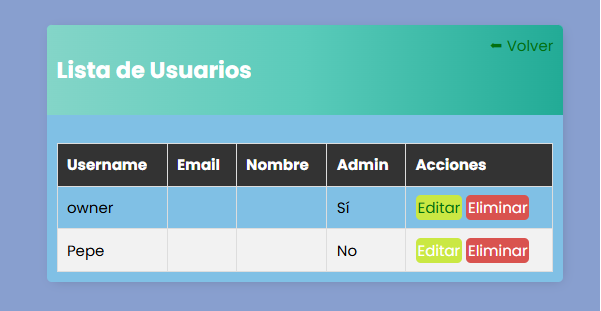

# Task Manager App

## Descripción 📌
Task Manager App es una aplicación web desarrollada con **Django** que permite a los usuarios gestionar sus tareas de manera eficiente. Incluye funcionalidades para la creación, edición y eliminación de tareas, así como la asignación de categorías y etiquetas. Además, cuenta con un panel de administración para gestionar usuarios y configuraciones.

## Características 🛠️
- 📌 Registro e inicio de sesión de usuarios.
- ✅ Creación, edición y eliminación de tareas.
- 🏷️ Gestión de categorías y etiquetas para organizar tareas.
- 🔍 Sistema de búsqueda y filtrado de tareas.
- 🔐 Panel de administración para gestionar usuarios.

## Tecnologías Utilizadas 💻
- **Backend:** Django (Python)
- **Base de Datos:** SQLite / PostgreSQL (opcional)
- **Frontend:** HTML, CSS
- **Autenticación:** Django Authentication System

## Instalación 🚀
### Requisitos Previos
Asegúrate de tener instalado **Python 3.x** y **pip** en tu sistema.

### 1. Clonar el Repositorio
```bash
git clone https://github.com/NGiancristiano/Task_Manager_app.git
cd Task_Manager_app
```

### 2. Crear un Entorno Virtual (Opcional, pero recomendado)
```bash
python -m venv venv
source venv/bin/activate  # Mac/Linux
venv\Scripts\activate    # Windows
```

### 3. Instalar Dependencias
```bash
pip install -r requirements.txt
```

### 4. Configurar la Base de Datos
```bash
python manage.py migrate
```

### 5. Crear un Superusuario (Para acceso al panel de administración)
```bash
python manage.py createsuperuser
```

### 6. Ejecutar el Servidor
```bash
python manage.py runserver
```
Accede a la aplicación en **http://127.0.0.1:8000/**

## Uso 📖
- Regístrate o inicia sesión.
- Agrega, edita o elimina tareas.
- Asigna categorías y etiquetas para organizar mejor las tareas.
- Administra usuarios desde el panel de administración si eres administrador.

## Capturas de Pantalla 📸












## Licencia 📜
Este proyecto está bajo la licencia **MIT**.

## Contacto 📧
Si tienes preguntas o sugerencias, puedes contactarme en **(https://www.linkedin.com/in/nicolas-giancristiano-suzuki/)**.

